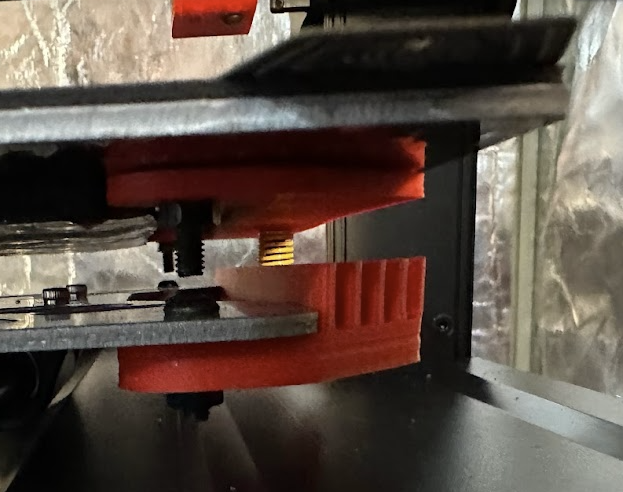

## 3 Point Carriage Adapter

## Disclaimer

Install and use at your own risk. Not responsible for you, your machine, or any damages.

### Parts list:

1 x [3 Point Carriage Adapter (Top)](3%20Point%20Carriage%20Adapter%20%28Top%29.stl)
- 50% tri-hexagon infill, .3mm layer height, 8 walls

1 x [3 Point Carriage Adapter (Bottom)](3%20Point%20Carriage%20Adapter%20%28Bottom%29.stl)
- 50% tri-hexagon infill, .3mm layer height, 8 walls

1 x [Bed Leveling Knob](Bed%20Leveling%20Knob.stl)

2 x Ender 3 25mm Yellow Springs

1 x M4 x 35mm screw

4 x M4 x 8mm screws

5 x M4 nuts

### Instructions

1. Unplug the printer
2. Remove the build surface
3. Remove the build plate 
4. Insert the M4 x 35mm screw into the 3 Point Carriage Adapter (Top) part
 - The fit is snug on purpose to help hold the screw
 - You may need to heat set the screw head into the part
5. Attach the 3 Point Carriage Adapter (Top) part to the right side of the build plate with 2 x M4 x 8mm screws and M4 nuts
6. Attached the 3 Point Carriage Adapter (Bottom) part to the right side of the carriage with 2 x M4 x 8mm screws and M4 nuts
- The ridges should be pointing up
7. Move a 16mm spacer from the right side to the left front corner (strain gauge)
8. Insert a spring between the left side rear build plate and wiring strain bracket
- **BE CAREFUL OR YOU COULD DAMAGE/DISCONNECT YOU BUILD PLATE HEATER WIRES**
9. Re-install the build plate
- When compressing the springs, compress (squeeze) the carriage and build plate together to compress the springs
- **DO NOT JUST PRESS ON THE BUILD PLATE OR YOU WILL BEND YOUR CARRIAGE**
- Use the the [Bed Leveling Knob](Bed%20Leveling%20Knob.stl) on the right side.
- This can be difficult due to limited space
10. Run bed leveling with a heated bed, adjust, and repeat

### Images

