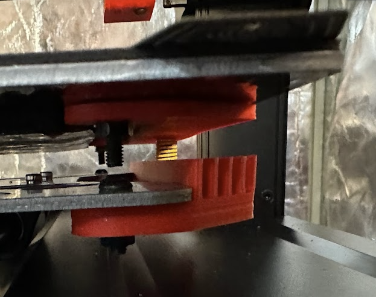

## 3 Point Carriage Conversion 

## Disclaimer

Install and use at your own risk. Not responsible for you, your machine, or any damages.

### Tools

A soldering iron or heat set insert tool is required

### Parts list:

1 x [3 Point Carriage Adapter (Top)](3%20Point%20Carriage%20Adapter%20%28Top%29.stl)
- PETG or ABS, 50% tri-hexagon infill, .3mm layer height, 8 walls

1 x [3 Point Carriage Adapter (Bottom)](3%20Point%20Carriage%20Adapter%20%28Bottom%29.stl)
- 50% tri-hexagon infill, .3mm layer height, 8 walls
- PETG or ABS

1 x [Bed Leveling Knob](Bed%20Leveling%20Knob.stl)

2 x Ender 3 25mm Yellow Springs

1 x M4 x 35mm screw

4 x M4 x 8mm screws

5 x M4 nuts

### Instructions

1. Unplug the printer
2. Remove the build surface
3. Remove the build plate
4. Use a heat set insert tool or soldering iron to set an M4 nut into the Bed Leveling Knob
5. Insert the M4 x 35mm screw into the 3 Point Carriage Adapter (Top) part
 - The fit is snug on purpose to help hold the screw
 - You may need to heat set the screw head into the part
6. Attach the 3 Point Carriage Adapter (Top) part to the right side of the build plate with 2 x M4 x 8mm screws and M4 nuts
7. Attached the 3 Point Carriage Adapter (Bottom) part to the right side of the carriage with 2 x M4 x 8mm screws and M4 nuts
- The ridges should be pointing up
8. Move a 16mm spacer from the right side to the left front corner (strain gauge)
9. Insert a spring between the left side rear build plate and wiring strain bracket
- **BE CAREFUL OR YOU COULD DAMAGE/DISCONNECT YOU BUILD PLATE HEATER WIRES**
10. Re-install the build plate
- When compressing the springs, compress (squeeze) the carriage and build plate together to compress the springs
- **DO NOT JUST PRESS ON THE BUILD PLATE OR YOU WILL BEND YOUR CARRIAGE**
- Use the the [Bed Leveling Knob](Bed%20Leveling%20Knob.stl) on the right side.
- This can be difficult due to limited space
11. Run bed leveling with a heated bed, adjust, and repeat

### Images

