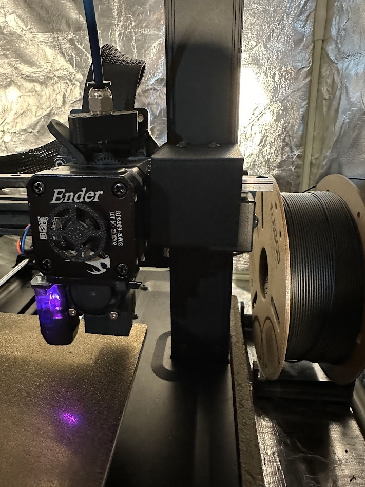
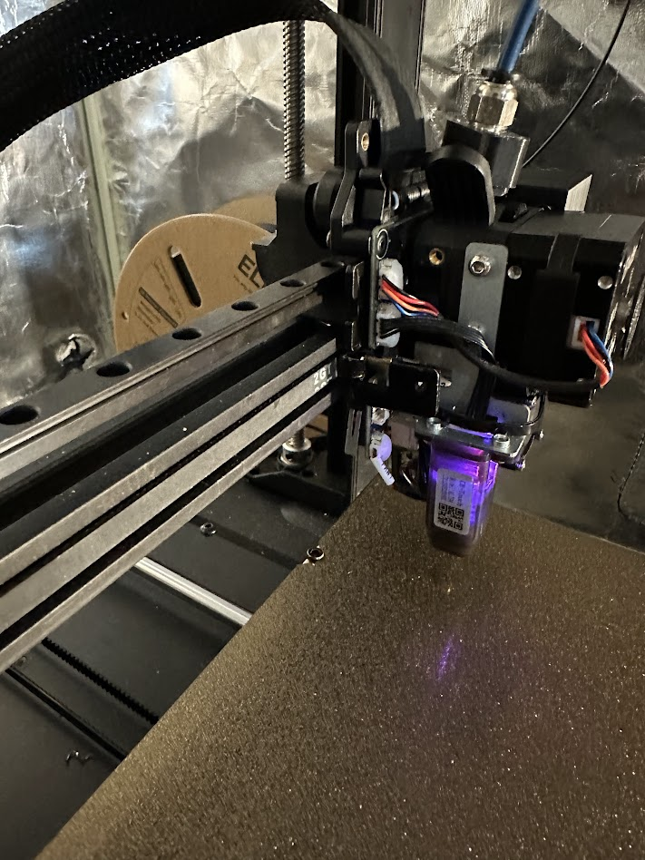

## X-axis linear rail

## Disclaimer

Install and use at your own risk. Not responible for you, your machine, or any damages.

### Parts list:

1 x MGN9H 350mm linear rail (preferably with z1 preset loading (common))
- an MGN12 rail will NOT work due to the carriage width (27mm)

2 x [MGN9 linear rail spacer blocks - left](https://github.com/dhoard/Ender-3-V3-SE/blob/main/x-axis-linear-rail/Ender%203%20V3%20SE%20MGN9%20linear%20rail%20spacer%20block%20-%20left.3mf)
- 50% cubic infill, .3mm layer height, 4 walls

5 x [MGN9 linear rail spacer blocks - center](https://github.com/dhoard/Ender-3-V3-SE/blob/main/x-axis-linear-rail/Ender%203%20V3%20SE%20MGN9%20linear%20rail%20spacer%20block%20-%20center.3mf)
- 50% cubic infill, .3mm layer height, 4 walls

1 x [MGN9 linear rail spacer blocks - right](https://github.com/dhoard/Ender-3-V3-SE/blob/main/x-axis-linear-rail/Ender%203%20V3%20SE%20MGN9%20linear%20rail%20spacer%20block%20-%20right.3mf)
- 50% cubic infill, .3mm layer height, 4 walls

1 x [MGN9H gantry mount](https://github.com/dhoard/Ender-3-V3-SE/blob/main/x-axis-linear-rail/Ender%203%20V3%20SE%20MGN9%20gantry%20mount.3mf)
 - 50% cubic infill, .3mm layer height, 4 walls 

12 x  M3-0.5 x 16mm button head screws

8 x M3 hammer head t-nuts

2 x MGN9 alignment tool
 - [https://www.thingiverse.com/thing:4976160](MGN9%20alignment%20tool)

### Instructions

1. Unplug the printer
2. Detach the printer tool head cable
3. Loosen the x-axis belt
4. Disassembly the printer tool head
5. Detach the x-axis belt
6. Remove the printer tool head x-axis gantry plate
7. Disassembly the tool head
8. Remove the v-wheels, spacers, and bolts
9. Attach the MGN9 linear rail to the x-axis extrusion with the spacer blocks between the rail and extrusion. The goal it place spacers in ever other hole, starting with the left most spacer... but your rail holes/spacing may be different
--  The linear rail should be offset to the right so that carriage can go completely to the x-axis belt adjuster
11. Attach the tool head to the gantry mount
12. Attach the x-axis belt
13. Attach the gantry mount to the MGN9H carriage
14. Assemble the printer tool head
15. Tighten the x-axis belt
16. Attach the printer tool head cable

### Images

V1

